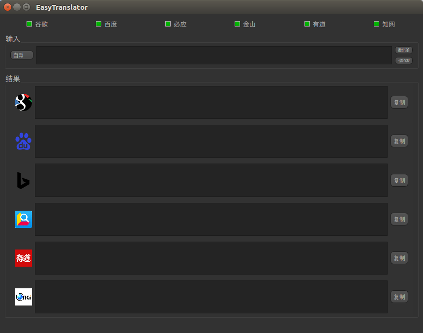

# 使用说明



- requirements

```txt
pyqtkeybind==0.0.3
requests==2.18.4
beautifulsoup4==4.8.1
PyQt5==5.8.2
PyQt5-sip==4.19.14
```

- 融合六个翻译引擎，支持中英互译
    - 谷歌
    - 百度
    - 金山
    - 有道
    - 必应
    - 知网
- 前 5 个翻译引擎主要用来翻译长句（中或英），知网翻译擅长学术词汇翻译（主要是中->英）
- 点击标题栏下方的 check box 选择要显示的翻译引擎
- 使用全局热键
    - 选中要翻译的文本 -> ctrl + c -> ctrl + Q : 剪贴板取词
    - ctrl + E : 退出